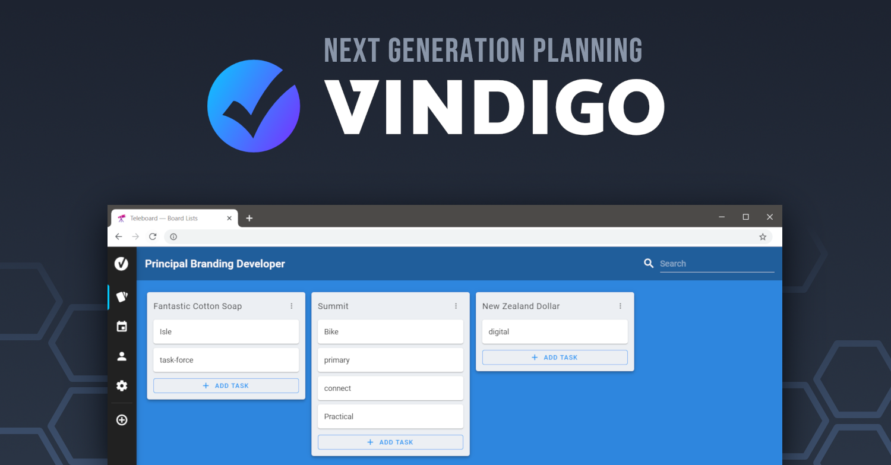

<p align="center">
  <a href="https://github.com/ExodiusStudios/vindigo/blob/master/LICENSE">
     
  </a>
  
  
</p>

---

# 🚧 **DISCLAIMER** 🚧
**This project is currently in early development and is currently not useable in any way, shape or form. Do not use in production!**

Once the project is in a more stable shape, contribution guidelines will be published as well. Stay tuned!

## Introducion

Vindigo is a next generation planning tool focused on productivity and usability for your team.

At its core, Vindigo offers an efficient way of creating, listing, and viewing your projects tasks. Inspired by other great planning tools, vindigo provides you with plenty of customization and extensibility, allowing it to fit your specific needs.

## Features
- Implements an easy to use task hierarchy (Boards - Lists - Tasks)
- Instant live syncing across multiple browsers
- User and account management on a per-board basis
- Self hosted for full control over your data and setup
- Support for theming and customized themes
- Extensible with plugins and an easy to use API
- Fully open source and licensed under [MIT](https://github.com/ExodiusStudios/vindigo/blob/master/LICENSE)

## Docker installation
You can find the production ready [vindigo image](https://hub.docker.com/r/macjuul/vindigo) on Docker Hub. Visit the docker hub page for instructions on how to run Vindigo using docker directly or using docker-compose.

## Manual installation

### Prerequisites
Vindigo is built using [node](https://nodejs.org/en/) which means you will need to install NodeJS version 12 or higher. Make sure you also also have npm, the package manager for node (it usually comes bundled directly with node).

### Setup
First, obtain a copy of Vindigo by cloning it from this repo
```
git clone https://github.com/ExodiusStudios/vindigo.git
```

Once you have obtained a local copy from github, run the following commands to prepare your instance.
```bash
npm install -g yarn  # Install the yarn package manager
yarn install         # Install required dependencies
```

You can now use the CLI to further proceed with the installation of Vindigo.

**Windows (Command Prompt)**
```
.\vindigo init
```

**Unix based systems (Bash)**
```bash
chmod +x ./vindigo  # Grant execute permission to the CLI
./vindigo init
```

### Using the CLI (Command-line Interface)

The CLI provides many useful commands allowing you to manage your Vindigo setup. In order to launch Vindigo, run the following command.

```
./vindigo start
```

Vindigo will be started in the background and can now be accessed on `http://localhost:8085`.

The CLI provides many more commands used to manage your Vindigo setup. The following snippet is directly generated from `./vindigo help`.

```
./vindigo <cmd> [options]

Commands:
  vindigo start                     Launch the Vindigo server
  vindigo stop                      Terminate the Vindigo server
  vindigo status                    Show the current daemon status
  vindigo init                      Configure your vindigo installation
  vindigo run                       Start the Vindigo server in the foreground
  vindigo migrate:apply [--all]     Apply pending database migrations
  vindigo migrate:rollback [-all]   Rollback a database migration
  vindigo migrate:status            View the current database migration status

Options:
  --version  Show version number
  --json     Print out all messages in JSON form
  --help     Show help
```

## Development setup
Before you can start contributing to Vindigo, make sure to follow the installation tutorial.

### Run development setup
During development you might want to enable live compiling, to do so run the following commands in separate terminals.

```bash
yarn workspace vindigo-server watch  # Automatically compile & start the server
yarn workspace vindigo-client watch  # Launch a Webpack dev server
yarn workspace vindigo-cli watch     # Automatically compile the CLI
```

You can now access Vindigo on `http://localhost:8080`.

Any changes made to the code will result in your changes being compiled live. Keep in mind while the CLI is automatically compiled you will still need to execute it manually.

### Developing with VSCode
When your editor of choice is Visual Studio Code, you will be able to find pre defined tasks you can use during development.

Simply navigate to `Terminal > Run Task...` and select which operation you want to execute.

### Building distribution files
Distributes files are built separately for all packages, however all can be built with a single command.

```
yarn build
```

### Publishing contributions

TODO: Code of Conduct

## License

[MIT](LICENSE)

Copyright (c) 2020-present, Julian Mills
